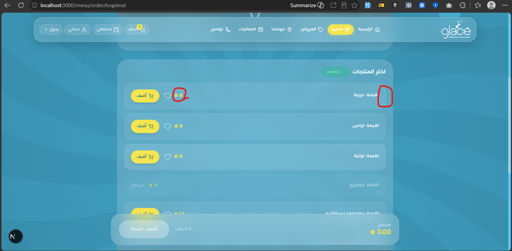

# 01 — أصناف flat-list: CRUD + صور (`items[]`)

**الأولوية:** عالية  
**Endpoints:** `GET /menu/products` · `GET /menu/products/{slug}`  
**الحالة الحيّة (2026-08-13):** `items[].price` موجود (seed) · **`items[].image` = null على 69/69** · **مفيش** تبويب أصناف في Filament

---

## المطلوب

على Edit منتج `kind: flat-list` أضيفوا Relation/Repeater **الأصناف**:

| حقل | مطلوب |
|---|---|
| `label` | ✅ |
| `price` | ✅ |
| `available` | ✅ |
| **`image`** | ✅ FileUpload → URL كامل |
| `isPremiumMixFlavor` | ✅ إن لزم |

ينطبق على كل الـ15 منتج flat-list / **69 صنف**.

---

## الدليل

ستورفرونت — السعر ظاهر · مكان الصورة فاضي:



داشبورد — تابين فقط (أساسية + عرض) · **بدون أصناف**:


```json
{
  "id": "arabian",
  "label": "لقيمة عربية",
  "price": 8,
  "available": true,
  "image": null
}
```

```bash
# لازم بعد الإصلاح: image غير null على كل العناصر
for slug in milkshake pancake waffle crepe pizza molten brownie cookies cheesecake kunafa loqaimat corn juices hot-drinks cold-drinks; do
  missing=$(curl -s "$API/menu/products/$slug" | jq '[.items[] | select(.image == null or .image == "")] | length')
  echo "$slug: missing=$missing"
done
```

---

## معايير قبول

- [ ] Filament فيه إدارة أصناف (سعر + صورة + توفّر)
- [ ] `items[].image` URL كامل على **69/69**
- [ ] أي تعديل من الأدمن يظهر فورًا على `/menu/order/{slug}`
