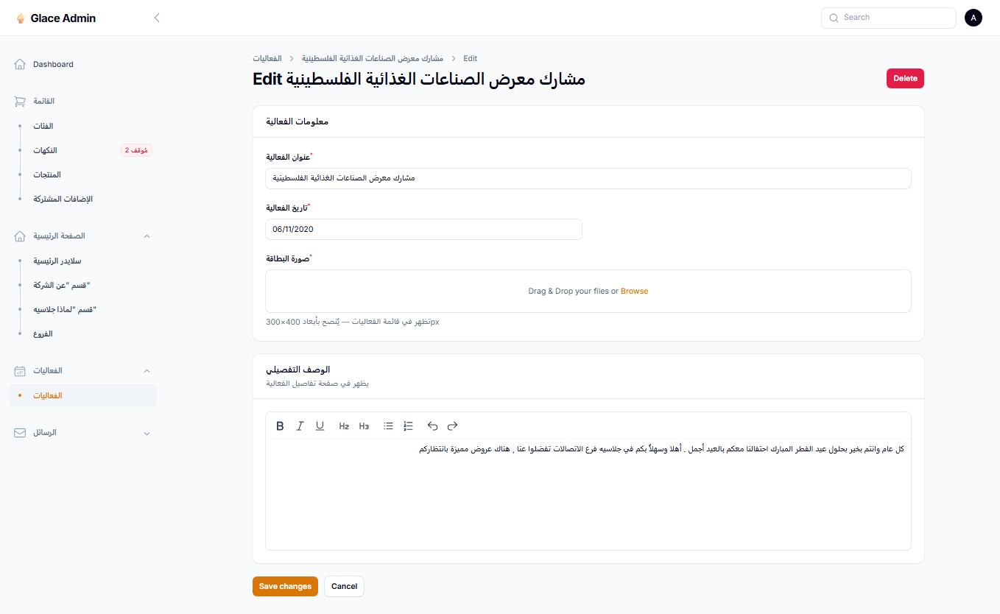

# 04 — الهوم والفعاليات (Home & Events)

**الأولوية:** عاجل للشكل + عملية يدوية للصور  
**Endpoints:** `GET /home` · `GET /events` · `GET /events/{id}`  
**تاريخ التحقق على الـAPI الحي:** 2026-08-11  
**إعادة تحقق:** 2026-08-12

---

## ملخص سريع

| # | البند | نوع الشغل | الحالة الحيّة (2026-08-12) |
|---|---|---|---|
| 1 | الصور مسار نسبي بدل URL كامل | كود (Resource / Accessor) | ✅ **مغلق** — الروابط absolute على `/storage/...` |
| 2 | `about.paragraphs` شكل غلط | كود (Resource) | ✅ **مغلق** — `string[]` |
| 3 | رفع صورة بطاقة للفعاليات الناقصة | يدوي من الأدمن | ⚠️ `listImage` على **3/10** فقط (1–3) · الهوم `image: null` |
| 4 | `home.events.items` من 3 ← 10 | كود (limit/take) | ✅ العدد ≥ 10 · ❌ الصور لسه فاضية على الهوم |
| 5 | معرض `images[]` لتفاصيل الفعالية | شاشة + جدول جديد | ❌ **مفيش حقل في الداشبورد** · `images` دايمًا `[]` |
| — | `whyGlace.features[].image` | لا تعملوا شيء | ملاحظة فقط — الفرونت بيتجاهلها |

---

## ✅ 1. الصور لازم ترجع URL كامل — **تم**

### الحالة بعد الإصلاح (2026-08-12)

الباك بيرجّع URL كامل، مثال:

```json
"listImage": "http://acw348d983gr8x01lb5myd3x.64.176.172.179.sslip.io/storage/events/01KZRF6GGTR1EZGK66MXY8HC5J.png"
"manImg": "http://acw348d983gr8x01lb5myd3x.64.176.172.179.sslip.io/storage/hero-slides/01KZRAB31FVVSVVAJNQD8YH3BY.png"
"image": "http://acw348d983gr8x01lb5myd3x.64.176.172.179.sslip.io/storage/about/01KZRDEBZ60TV1QE6QW33NDEPD.png"
```

الفرونت (`resolveMediaSrc`) بيمرّر الروابط absolute كما هي لـ`next/image`.

### معايير قبول — متحققة

- [x] حقول الصور المرفوعة في `/home` و`/events` تبدأ بـ`http://` أو `https://`
- [x] المسار يتضمن `/storage/...`
- [x] مفيش قيم نسبية زي `hero-slides/...` بدون origin (لما الصورة موجودة)
- [x] الروابط تفتح في المتصفح مباشرة

```bash
curl -s "$API/home" | jq '.. | objects | .. | strings | select(test("^(hero-slides|about|events|products|flavors)/"))'
# المتوقع: لا نتائج
```

> **ملاحظة:** `null` لسه مقبول لما مفيش رفع. المشكلة المتبقية = تعبئة الصور الناقصة (بند 3) + تضمينها في `home.events.items` + معرض `images[]` (بند 5) — مش شكل الـURL.

---

## ✅ 2. `about.paragraphs` = مصفوفة نصوص مباشرة — **تم**

### الحالة بعد الإصلاح

```json
"paragraphs": [
  "تأسس جلاسيه الأمير عام 2015...",
  "تعمل الشركة على تقديم أجود أنواع الآيس كريم..."
]
```

### معايير قبول — متحققة

- [x] `typeof paragraphs[0] === "string"`
- [x] مفيش عنصر من نوع object داخل المصفوفة

```bash
curl -s "$API/home" | jq '.about.paragraphs | map(type) | unique'
# المتوقع: ["string"]
```

---

## 🟡 3. رفع صورة بطاقة للفعاليات الناقصة (يدوي)

### دليل من الداشبورد

شاشة تعديل الفعالية — حقل **«صورة البطاقة»** موجود (يقابل `listImage`). **مفيش** حقل لمعرض `images[]`:



### الحالة (2026-08-12)

حقل الأدمن **«صورة البطاقة»** موجود ويعمل ويرجّع URL كامل.  
على `/events`: ids **1، 2، 3** عندهم `listImage`؛ **4–10** = `null`.  
على `/home`: الحقل اسمه `image` (مش `listImage`) وكل القيم حالياً `null` — حتى للفعاليات اللي صورتها موجودة في `/events`.

### المطلوب

1. من شاشة تعديل الفعالية → ارفعوا «صورة البطاقة» للفعاليات **4 إلى 10** (وكل فعالية جديدة).
2. في Resource الهوم: عبّوا `home.events.items[].image` من نفس مصدر `listImage` (URL كامل)، مش تسيبوه `null` لما البطاقة موجودة.

### معايير قبول

- [ ] كل فعالية ظاهرة في `/events` عندها `listImage` غير `null`
- [ ] `home.events.items[].image` غير `null` لنفس الفعاليات اللي عندها بطاقة
- [ ] بطاقات قائمة الفعاليات والهوم تظهر thumbnails حقيقية

```bash
curl -s "$API/events?perPage=20" | jq '[.items[] | {id, listImage: (.listImage != null)}]'
curl -s "$API/home" | jq '[.events.items[] | {id, image}]'
```

---

## ✅ 4. `home.events.items`: من 3 إلى 10 — **تم العدد**

### الحالة بعد الإصلاح

```text
home.events.items length = 10
```

العدد تمام. المتبقي مرتبط ببند 3 (الصور على عناصر الهوم لسه `image: null`).

```bash
curl -s "$API/home" | jq '.events.items | length'
# المتوقع: 10 (أو عدد الفعاليات إن < 10)  ✅
```

---

## 🔴 5. معرض صور تفاصيل الفعالية `images[]` — **مفيش مكان في الداشبورد**

### المشكلة (حاسمة)

في شاشة تعديل الفعالية **لا يوجد أي حقل** لصور الفعالية الواحدة (معرض صفحة التفاصيل).

الموجود فقط:

| في الداشبورد | يقابل في الـAPI |
|---|---|
| عنوان الفعالية | `title` |
| تاريخ الفعالية | `date` |
| **صورة البطاقة** | `listImage` |
| الوصف التفصيلي | `description` |

**مش موجود نهائيًا:** رفع / إدارة `images[]` (صور المعرض داخل صفحة الفعالية الواحدة).

لذلك الـAPI **دايمًا** بيرجّع `images` فاضية على كل الفعاليات — حتى لو `listImage` موجودة:

```json
{
  "id": 6,
  "title": "أجواء العيد مع جلاسيه غير",
  "date": "11/06/2020",
  "description": "كل عام وانتم بخير بحلول عيد الفطر المبارك احتفالنا معكم بالعيد أجمل . أهلا وسهلاُ بكم في جلاسيه فرع الاتصالات تفضلوا عنا , هناك عروض مميزة بانتظاركم",
  "listImage": null,
  "images": []
}
```

والدليل من الأدمن — صورة البطاقة فقط، بدون أي FileUpload للمعرض:


الفرونت حالياً يعمل fallback على `listImage` للمعرض — **workaround مؤقت** لأن `images` عمرها ما بتتملّى من الداشبورد.

### المطلوب

1. **جدول** منفصل مثلاً:

| عمود | نوع | ملاحظة |
|---|---|---|
| `id` | PK | |
| `event_id` | FK → events | |
| `path` / `url` | string | مسار التخزين |
| `sort_order` | int | ترتيب العرض |

2. **شاشة Filament على Edit Event:** حقل رفع متعدد جديد (FileUpload multiple / Repeater) بعنوان واضح مثل **«معرض صور الفعالية»** — **غير** حقل «صورة البطاقة».
3. **الـAPI:**

```json
"images": [
  "http://acw348d983gr8x01lb5myd3x.64.176.172.179.sslip.io/storage/events/6-a.png",
  "http://acw348d983gr8x01lb5myd3x.64.176.172.179.sslip.io/storage/events/6-b.png"
]
```

- مصفوفة strings (URL كامل)
- **بدون** `null` داخل المصفوفة — إما روابط أو `[]` فارغة لما الأدمن ما رفعش
- العقد يطلب `images` في `IEvent.required`

### معايير قبول

- [ ] في الداشبورد يظهر حقل واضح لرفع صور المعرض (مش صورة البطاقة)
- [ ] من الأدمن تقدر ترفع أكثر من صورة لمعرض فعالية واحدة
- [ ] `GET /events/{id}` و`GET /events` يرجّعوا `images` كمصفوفة روابط حقيقية بعد الرفع (مش تفضل `[]` دايمًا)
- [ ] مفيش `null` داخل `images`
- [ ] صفحة تفاصيل الفعالية `/events/{id}` تعرض المعرض من الـAPI بدون الاعتماد على fallback الفرونت

```bash
curl -s "$API/events/6" | jq '{id, listImage, images}'
# قبل الإصلاح: images = []
# بعد الإصلاح (بعد رفع من الأدمن): images = ["http.../storage/...", ...]
```

---

## ⚪ ملاحظة — لماذا جلاسيه

خلفيات أزرار «لماذا جلاسيه» (الملوّنة تحت كل ميزة) **مش من الباك** — زينة تصميم ثابتة في الفرونت (تبديل أزرق/بني حسب الترتيب).

لو بتبعتوا `image` مع كل `whyGlace.features[]` → **مش لازم**. الفرونت بيتجاهلها والعقد يقول صراحة: لا ترسلوا صورة هنا.

---

## ترتيب التنفيذ المتبقي

1. **بند 3** — رفع بطاقات 4–10 + ربط `home.events.items[].image` بنفس الـURL  
2. **بند 5** — جدول + شاشة معرض `images[]`

بند 1 (URL كامل) وبند 2 (`paragraphs`) وبند 4 (limit 10) = **مقفولين**.

بعدها: راجعوا [`08-qa-remaining.md`](./08-qa-remaining.md) و[`03-media-and-cleanup.md`](./03-media-and-cleanup.md) لأي بنود وسائط متبقية على المنيو.
