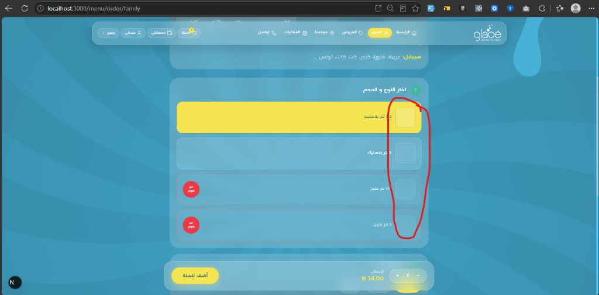
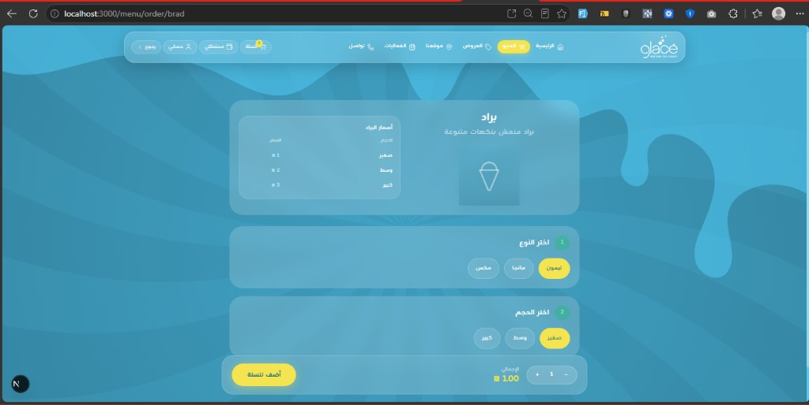
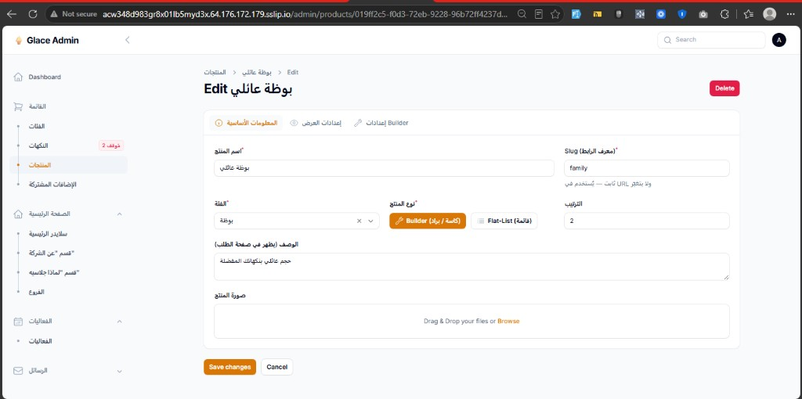

# 05 — التحكم بالأنواع والأحجام من الداشبورد

**الأولوية:** عالية  
**Endpoints:** `GET /menu/products` · `GET /menu/products/{slug}`  
**Schema:** `ISizeOption` · `IContainerOption` في `docs/swagger.yaml`  
**تاريخ:** 2026-08-11 · **إعادة تحقق:** 2026-08-12 (أمثلة حية: `cup` · `family` · `brad`)

---

## قرار المنتج

الأدمن يقدر من **Filament** يضيف / يعدّل / يحذف **الأنواع** و**الأحجام** و**أسعارها** لكل منتج `kind: "builder"` (`cup` · `family` · `brad` · `brad-boza` …).

**مش المقصود** نصوص العناوين «اختر النوع» / «اختر الحجم» — دي تبقى في الفرونت.  
**المقصود** محتوى الأزرار نفسها:

| على الشاشة | مصدر البيانات | إدارة من الداشبورد |
|---|---|---|
| كاسة · بسكوت · تيك اواي / بلاستيك · فلين | `containerOptions[]` | ✅ CRUD مطلوب |
| صغير · وسط · كبير / 1/2 لتر · 1 لتر | `sizes[]` | ✅ CRUD مطلوب |
| أسعار كل حجم | `sizes[].prices` | ✅ مطلوب |
| صورة صف الحجم (خصوصًا العائلي) | `sizes[].image` | ✅ مطلوب |
| عنوان الخطوة «اختر النوع / الحجم» | نص فرونت ثابت | ❌ مش مطلوب من الباك |

أي تغيير من الأدمن يظهر فوراً على `/menu/order/{slug}` بدون deploy فرونت.

---

## الحكم (حاسم) — ينطبق على **كل** builder بما فيها `cup` و`family`

| | في الـAPI | في الداشبورد |
|---|---|---|
| `containerOptions[]` — «اختر النوع» | ✅ بيرجع (seed) | ❌ **مفيش تحكم** |
| `sizes[]` — «اختر الحجم» | ✅ بيرجع (seed) | ❌ **مفيش تحكم** |
| `sizes[].prices` — أسعار الأحجام | ✅ بيرجع مع الأنواع/الأحجام | ❌ **مفيش تحكم في الأسعار** |
| `sizes[].image` | ❌ **مش راجع** | ❌ **مفيش رفع** |

الأنواع + الأحجام + الأسعار **بيرجعوا مع بعض في الـAPI**، بس الأدمن **ما عندهوش أي واجهة** يغيّرهم منها.

---

## دليل 1 — `cup` / بوظة كاسة

نفس المشكلة: مفيش تحكم في الداشبورد لـ«اختر النوع» ولا «اختر الحجم» ولا الأسعار — والثلاثتهم بيرجعوا من الـAPI.

عيّنة حية من `GET /menu/products/cup`:

```json
{
  "slug": "cup",
  "kind": "builder",
  "name": "بوظة كاسة",
  "image": null,
  "containerOptions": [
    { "id": "cup", "label": "كاسة", "available": true, "pricingLabel": "الكاسة" },
    { "id": "biscuit", "label": "بسكوت", "available": true, "pricingLabel": "البسكوت" },
    { "id": "takeaway", "label": "تيك اواي", "available": true, "pricingLabel": "التيك اواي" }
  ],
  "sizes": [
    {
      "id": "cup-small",
      "label": "صغير",
      "maxBalls": 1,
      "available": true,
      "containerId": "cup",
      "prices": [
        { "flavorFamily": "classic", "price": 2 },
        { "flavorFamily": "special", "price": 4 }
      ]
    },
    {
      "id": "biscuit-small",
      "label": "صغير",
      "maxBalls": 1,
      "available": true,
      "containerId": "biscuit",
      "prices": [
        { "flavorFamily": "classic", "price": 2 }
      ]
    },
    {
      "id": "takeaway-size",
      "label": "تيك اواي",
      "maxBalls": 3,
      "available": true,
      "containerId": "takeaway",
      "prices": [
        { "flavorFamily": "classic", "price": 5 },
        { "flavorFamily": "special", "price": 7 }
      ]
    }
  ]
}
```

| على `/menu/order/cup` | مصدر API | داشبورد |
|---|---|---|
| كاسة · بسكوت · تيك اواي | `containerOptions` | ❌ مفيش تحكم |
| صغير · وسط · كبير | `sizes` | ❌ مفيش تحكم |
| أسعار الجدول (مثلاً كاسة صغير classic = 2) | `sizes[].prices` | ❌ مفيش تحكم |
| `sizes[].image` | مش راجع | ❌ مفيش رفع |

```bash
curl -s "$API/menu/products/cup" | jq '{
  containers: .containerOptions,
  sizes: [.sizes[] | {id, label, containerId, prices, image}]
}'
```

---

## دليل 2 — `family` / بوظة عائلي

على `/menu/order/family` صفوف النوع/الحجم ظاهرة والأسعار شغالة، لكن **مكان صورة الحجم فاضي**:



عيّنة حية مختصرة من `GET /menu/products/family`:

```json
{
  "slug": "family",
  "kind": "builder",
  "name": "بوظة عائلي",
  "image": null,
  "containerOptions": [
    { "id": "plastic", "label": "بلاستيك", "available": true },
    { "id": "foam", "label": "فلين", "available": false }
  ],
  "sizes": [
    {
      "id": "plastic-half",
      "label": "1/2 لتر",
      "maxBalls": 8,
      "available": true,
      "containerId": "plastic",
      "prices": [
        { "flavorFamily": "classic", "price": 14 },
        { "flavorFamily": "special", "price": 18 },
        { "flavorFamily": "mix", "price": 16 }
      ]
    }
  ]
}
```

لاحظ: فيه `prices` · **مفيش** `image` على الـsize.

---

## دليل 3 — `brad` / براد

نفس النقص: الأحجام والأسعار ظاهرة على الفرونت من الـAPI، و**مفيش تحكم** في الداشبورد.

على `/menu/order/brad` — جدول أسعار البراد (صغير 1 · وسط 2 · كبير 3) + اختر النوع (ليمون/مانجا/مكس) + اختر الحجم:



عيّنة حية من `GET /menu/products/brad`:

```json
{
  "slug": "brad",
  "kind": "builder",
  "name": "براد",
  "pricingLabel": "أسعار البراد",
  "containerOptions": [
    { "id": "lemon", "label": "ليمون", "available": true },
    { "id": "mango", "label": "مانجا", "available": true },
    { "id": "mix", "label": "مكس", "available": true }
  ],
  "sizes": [
    {
      "id": "brad-small",
      "label": "صغير",
      "available": true,
      "prices": [{ "flavorFamily": "classic", "price": 1 }]
    },
    {
      "id": "brad-medium",
      "label": "وسط",
      "available": true,
      "prices": [{ "flavorFamily": "classic", "price": 2 }]
    },
    {
      "id": "brad-large",
      "label": "كبير",
      "available": true,
      "prices": [{ "flavorFamily": "classic", "price": 3 }]
    }
  ]
}
```

| على `/menu/order/brad` | مصدر API | داشبورد |
|---|---|---|
| ليمون · مانجا · مكس | `containerOptions` | ❌ مفيش تحكم |
| صغير · وسط · كبير | `sizes` | ❌ **مفيش تحكم في الأحجام** |
| 1 / 2 / 3 ₪ | `sizes[].prices` | ❌ **مفيش تحكم في الأسعار** |
| عنوان «أسعار البراد» | `pricingLabel` | ⚠️ قابل للتعديل من إعدادات Builder فقط |

```bash
curl -s "$API/menu/products/brad" | jq '{
  pricingLabel,
  containers: .containerOptions,
  sizes: [.sizes[] | {id, label, prices, image}]
}'
```

---

## دليل من الداشبورد (نفس الشكل على cup و family و brad و brad-boza)

شاشة Edit builder — معلومات أساسية / إعدادات العرض / إعدادات Builder فقط.  
**مفيش** أي واجهة للأنواع أو الأحجام أو أسعار الأحجام أو صور الأحجام:



تبويب **إعدادات Builder** الحالي فيه فقط:

- وضع الاختيار (Toggle / Repeatable)
- عائلات النكهات
- نص `pricingLabel`
- سويتش «يتضمن خطوة أضف بوظة»

**مش موجود في الأدمن (لكل builder بما فيها بوظة كاسة والبراد):**

- إضافة / تعديل / حذف **الأنواع** (`containerOptions`) — خطوة «اختر النوع»
- إضافة / تعديل / حذف **الأحجام** (`sizes`) — خطوة «اختر الحجم»
- تعديل **الأسعار** داخل `sizes[].prices` (كاسة · عائلي · **براد** · براد-بوظة)
- رفع **صورة حجم** (`sizes[].image`) وإرجاعها في الـAPI
- تعديل **`iceCreamAddonPrices`** (brad-boza)

---

## أ) CRUD الأنواع — `containerOptions[]`

| حقل | نوع | ملاحظة |
|---|---|---|
| `id` | string | ثابت بعد الإنشاء — زي `cup` / `lemon` / `plastic` |
| `label` | string | النص على الزر («كاسة»، «ليمون»، …) |
| `available` | toggle | إيقاف نوع بدون حذفه |
| `name` | string؟ | اسم ملخص الطلب إن لزم |
| `image` | FileUpload؟ | fallback لصورة الحجم / thumbnail |
| `pricingLabel` | string؟ | عنوان جدول أسعار الحاوية («الكاسة») |

| منتج | أمثلة أنواع |
|---|---|
| `cup` | كاسة · بسكوت · تيك اواي |
| `family` | بلاستيك · فلين |
| `brad-boza` | ليمون · مانجا · مكس |
| `brad` | حسب التعريف الحالي |

إضافة نوع جديد من الأدمن → يظهر زر جديد في خطوة الأنواع فوراً.

---

## ب) CRUD الأحجام — `sizes[]` (+ صورة)

| حقل | نوع | ملاحظة |
|---|---|---|
| `id` | string | ثابت — زي `cup-small` / `plastic-half` |
| `label` | string | «صغير» / «1/2 لتر» |
| `maxBalls` | int | حد الكرات |
| `containerId` | select؟ | يربط بنوع؛ فاضي = حجم مشترك (brad-boza) |
| `available` | toggle | |
| **`image`** | FileUpload | مفضّل لصفوف العائلي |
| `prices[]` | repeater | `flavorFamily` + `price` |

```json
{
  "id": "plastic-half",
  "label": "1/2 لتر",
  "maxBalls": 8,
  "available": true,
  "containerId": "plastic",
  "image": "https://host/storage/sizes/family-plastic-half.png",
  "prices": [
    { "flavorFamily": "classic", "price": 14 },
    { "flavorFamily": "special", "price": 18 },
    { "flavorFamily": "mix", "price": 16 }
  ]
}
```

الفرونت يعرض صورة الصف من: `sizes[].image` ثم fallback `containerOptions[].image`.

### عائلي حالياً (حي) — أسعار موجودة · صور غائبة

| الصف | `size.id` | `containerId` | سعر classic | `sizes[].image` |
|---|---|---|---:|---|
| 1/2 لتر بلاستيك | `plastic-half` | `plastic` | 14 | ❌ مش راجع |
| 1 لتر بلاستيك | `plastic-one` | `plastic` | 28 | ❌ مش راجع |
| 1/2 لتر فلين | `foam-half` | `foam` | 16 | ❌ مش راجع (الحاوية موقوفة) |
| 1 لتر فلين | `foam-one` | `foam` | 31 | ❌ مش راجع |

```bash
curl -s "$API/menu/products/family" | jq '{
  containers: .containerOptions,
  sizes: [.sizes[] | {id, label, containerId, image, prices}]
}'
```

---

## ج) براد مع بوظة — أسعار الإضافة أيضاً

| إجراء من الداشبورد | النتيجة على `/menu/order/brad-boza` |
|---|---|
| تغيير سعر حجم صغير 1 → 5 | الجدول والإجمالي يتحدّثوا |
| إيقاف نوع مانجا | الزر يظهر «غير متوفر» |
| إضافة نوع برتقال | زر رابع في الأنواع |
| تغيير `iceCreamAddonPrices.classic` 3 → 4 | صغير+كلاسيك = 5 بدل 4 |

```json
{
  "containerOptions": [
    { "id": "lemon", "label": "ليمون", "available": true },
    { "id": "mango", "label": "مانجا", "available": true },
    { "id": "mix", "label": "مكس", "available": true }
  ],
  "sizes": [
    {
      "id": "brad-boza-small",
      "label": "صغير",
      "maxBalls": 2,
      "available": true,
      "prices": [{ "flavorFamily": "classic", "price": 1 }]
    }
  ],
  "iceCreamAddonPrices": [
    { "flavorFamily": "classic", "price": 3 },
    { "flavorFamily": "special", "price": 5 },
    { "flavorFamily": "mix", "price": 4 }
  ]
}
```

---

## د) انعكاس على الـAPI

أي تعديل أدمن ينعكس على:

- `GET /menu/products/{slug}`
- `GET /menu/products` (نفس الشكل؛ القائمة بدون `flavors` الطويل)

URL الصور: كامل عبر `Storage::disk('public')->url(...)`.

---

## معايير القبول

- [ ] من الأدمن: CRUD كامل لـ`containerOptions` (الأنواع / «اختر النوع») لكل builder بما فيها `family`
- [ ] من الأدمن: CRUD كامل لـ`sizes` (الأحجام / «اختر الحجم»)
- [ ] من الأدمن: تعديل **`sizes[].prices`** يظهر فورًا على `/menu/order/family` (مثلاً classic نصف بلاستيك 14 → قيمة جديدة)
- [ ] من الأدمن: رفع صورة حجم → الـAPI يرجّع `sizes[].image` كـURL كامل (مش يختفي الحقل)
- [ ] من الأدمن: تعديل `iceCreamAddonPrices` لـ`brad-boza`
- [ ] إضافة نوع أو حجم جديد يظهر في صفحة الطلب بدون deploy فرونت
- [ ] `/menu/order/family` تعرض thumbnails مش أماكن فاضية
- [ ] إيقاف `available` على نوع أو حجم ينعكس في الواجهة
- [ ] **لا** حقول عناوين خطوات (`typeStepTitle` …) — مش جزء من هذا الطلب

```bash
curl -s "$API/menu/products/cup" | jq '{containers: .containerOptions, sizes: [.sizes[] | {id, label, containerId, prices, image}]}'
curl -s "$API/menu/products/family" | jq '.sizes[] | {id, label, image, available, containerId, prices}'
curl -s "$API/menu/products/brad-boza" | jq '{containers: .containerOptions, sizes: [.sizes[] | {id, label, prices, image}], iceCreamAddonPrices}'
```

---

## ملاحظة فرونت (تم)

- النوع / الحجم / الأسعار بتتنقرأ من الـAPI فقط (مفيش hardcode لليمون/صغير/…).
- عناوين الخطوات «اختر النوع» / «اختر الحجم» ثابتة في الفرونت — مش من الباك.
- `ISizeOption.image` موجود في الـtypes والـSwagger؛ العائلي يعرض thumbnail أو placeholder.
