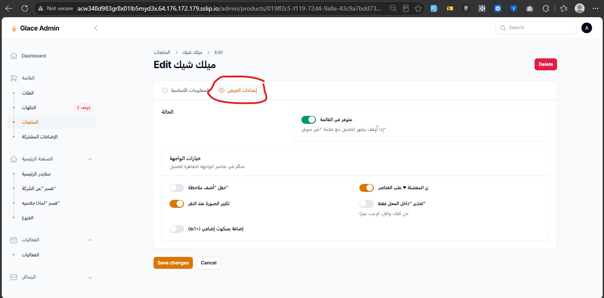
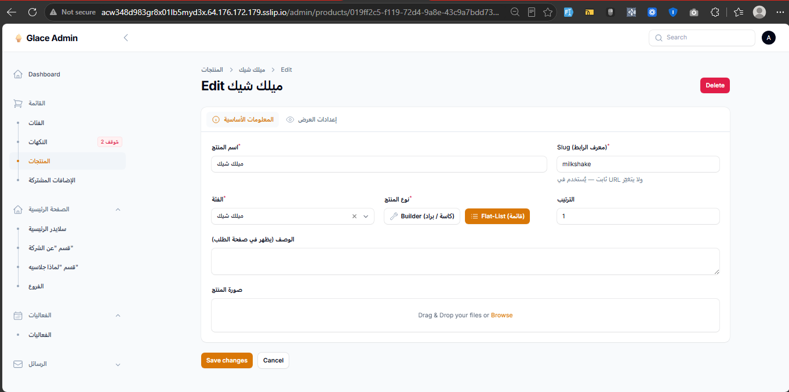

# 07 — مكس / سوبر مكس: CRUD من الداشبورد (flat-list)

**الأولوية:** عالية  
**Endpoints:** `GET /menu/products` · `GET /menu/products/{slug}`  
**Schema:** `IMixRule` · `IFlatListProduct` في `docs/swagger.yaml`  
**تاريخ التحقق:** 2026-08-11

---

## قرار المنتج

الأدمن يقدر من **Filament** يدير قواعد **المكس** و**السوبر مكس** لكل منتج `kind: "flat-list"` اللي بيحتاجها — بدون تعديل كود أو seed يدوي.

الفرونت جاهز: بقرأ `mixes[]` ويعرض قسم «المكسات»؛ لو `available: false` المكس بيختفي.

---

## دليل من الداشبورد (2026-08-12)

نفس شاشة منتج flat-list — تاب «إعدادات العرض» فيه سويتشات واجهة فقط. **مفيش** CRUD لـ`mixes[]`:





**المطلوب:** تبويب أو Repeater للمكسات (label · pick · أسعار · itemIds · available).

> ملاحظة مرتبطة بتذكرة [`01`](./01-items-image.md): أسعار وصور **أصناف** الـ`items[]` كمان بترجع من الـAPI ومفيش لها مكان في الداشبورد — شوف `loqaimat.png`.

---

## الحالة الحالية

### الـAPI (شغّال — بيانات متسيّدة)

| slug | `mixes` |
|---|---|
| `pizza` · `crepe` · `waffle` · `pancake` · `loqaimat` | `mix` + `super-mix` |
| `kunafa` | `mix` فقط |
| باقي flat-list (`milkshake` · `corn` · …) | مفيش `mixes` |

مثال حي `pancake`:

```json
{
  "mixes": [
    {
      "id": "mix",
      "label": "مكس (اختر طعمين)",
      "available": true,
      "pick": 2,
      "basePrice": 14,
      "flavorPrice": 7,
      "premiumFlavorPrice": 11,
      "itemIds": ["nutella", "lotus", "pistachio"]
    },
    {
      "id": "super-mix",
      "label": "سوبر مكس (اختر ثلاثة أطعمة)",
      "available": true,
      "pick": 3,
      "basePrice": 18,
      "flavorPrice": 6,
      "premiumFlavorPrice": 10,
      "itemIds": ["nutella", "lotus", "pistachio"]
    }
  ]
}
```

### الداشبورد (ناقص)

Edit منتج flat-list (مثال بان كيك) فيه فقط:

- تبويب **المعلومات الأساسية**
- تبويب **إعدادات العرض** (سويتشات ملاحظات / مفضلة / …)

**مش موجود:** أي واجهة لـ`mixes[]` — لا إضافة ولا تعديل أسعار ولا اختيار الأصناف ولا إيقاف.

---

## المطلوب في Filament

على Edit منتج `flat-list` → Relation Manager / Repeater **المكسات**:

| حقل | نوع | ملاحظة |
|---|---|---|
| `id` | string | ثابت بعد الإنشاء — زي `mix` / `super-mix` (seed-time؛ ما يتغيّرش بعد ما يتربط بطلبات) |
| `label` | string | يظهر للزبون — «مكس (اختر طعمين)» |
| `pick` | int | عدد الأطعمة المطلوب اختيارها (2 للمكس، 3 للسوبر عادةً) |
| `basePrice` | number | سعر الأساس |
| `flavorPrice` | number | سعر الطعم العادي داخل المكس |
| `premiumFlavorPrice` | number | سعر الطعم الـpremium (`items[].isPremiumMixFlavor: true`) |
| `itemIds` | multi-select | أصناف المنتج (`items[].id`) المسموح اختيارها داخل المكس |
| `available` | toggle | `false` → المكس يختفي من صفحة الطلب |

### عمليات مطلوبة

1. **إضافة** قاعدة مكس جديدة لمنتج (مثلاً إضافة سوبر مكس لـ`kunafa`)
2. **تعديل** label / أسعار / pick / itemIds
3. **إيقاف** مكس بدون حذفه (`available: false`)
4. **حذف** قاعدة (بحذر — لو في طلبات تاريخية مربوطة بـ`id`)
5. **ترتيب** العرض إن أمكن

أي تغيير ينعكس فوراً على:

- `GET /menu/products/{slug}` → `mixes[]`
- `GET /menu/products` (نفس الشكل)

---

## قواعد عقد مهمة

- `itemIds` تشاور على **`items[].id`** لنفس المنتج — **مش** labels عربية و**مش** flavor ids.
- `items[].isPremiumMixFlavor` يتحكّم هل الصنف يتسعّر بـ`premiumFlavorPrice` داخل المكس (مثلاً بيستاشيو) — لازم الأدمن يقدر يفعّله على عنصر الصنف كمان.
- الفرونت يخفي أي مكس بـ`available === false` (أو محذوف من المصفوفة).

```tsx
(product.mixes ?? []).filter((m) => m.available !== false)
```

---

## أمثلة قبول سريعة

| إجراء من الأدمن | النتيجة على `/menu/order/pancake` |
|---|---|
| إيقاف `super-mix` | زر السوبر مكس يختفي |
| تغيير `mix.basePrice` 14 → 20 | النص «من 20 ₪» يتحدّث |
| إضافة `itemIds` لصنف جديد | يظهر في مودال اختيار الأطعمة |
| إضافة `mix` لمنتج كان بدون مكسات | يظهر قسم «المكسات» بدون deploy فرونت |

---

## معايير القبول

- [ ] من الأدمن: CRUD كامل لـ`mixes[]` على منتجات flat-list
- [ ] تعديل `basePrice` / `flavorPrice` / `premiumFlavorPrice` / `pick` / `label` / `itemIds` / `available`
- [ ] إيقاف مكس يظهر فوراً في الـAPI وصفحة الطلب
- [ ] `itemIds` من multi-select على أصناف نفس المنتج فقط
- [ ] الأدمن يقدر يضبط `items[].isPremiumMixFlavor` على الأصناف
- [ ] المنتجات الحالية (`pancake` …) تظل قابلة للتعديل من الواجهة (مش seed فقط)

```bash
curl -s "$API/menu/products/pancake" | jq '.mixes[] | {id, label, available, pick, basePrice, flavorPrice, premiumFlavorPrice, itemIds}'
curl -s "$API/menu/products/kunafa" | jq '.mixes'
```

---

## ملاحظة فرونت (تم)

- `MixOrderSection` + `MixFlavorModal` بتقرا من الـAPI فقط.
- مفيش hardcode لأسعار أو قوائم مكس/سوبر مكس في الفرونت.
- صف الطعم في المودال يعرض: **صورة** (`items[].image`) + **اسم** (`label`) + **سعر** الوحدة داخل المكس (`flavorPrice` / `premiumFlavorPrice`).
- الصور الفاضية في المودال = نفس نقص [`01-items-image.md`](./01-items-image.md).
